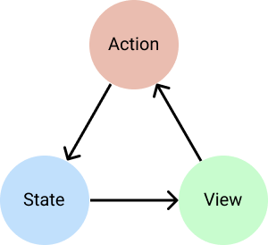

# Reduktor (RxJava 2)

[](https://github.com/g000sha256/Reduktor-RxJava/blob/2.x/License)
[](https://jitpack.io/#g000sha256/Reduktor-RxJava)
[](https://travis-ci.com/github/g000sha256/Reduktor-RxJava)
[](https://www.codacy.com/gh/g000sha256/Reduktor-RxJava)
[](https://www.codacy.com/gh/g000sha256/Reduktor-RxJava)

[](https://github.com/g000sha256/Reduktor-Coroutines)
[](https://github.com/g000sha256/Reduktor-RxJava/tree/3.x)

Библиотека помогает реализовать подход `Unidirectional Data Flow`.
При таком подходе всё представляется в виде потока действий.
Действие может изменить состояние системы, вызвать сайд-эффекты и породить другие действия.
На выходе получаем актуальное состояние, которое можно отобразить в интерфейсе.



## Добавление зависимости
```groovy
dependencies {
    implementation "com.github.g000sha256:Reduktor-RxJava:2.0"
}
repositories {
    maven { url "https://jitpack.io" }
}
```
## Описание
Библиотека представлена как экстеншн `Flowable<ACTION>.toStoreFlowable(...): Flowable<STATE>`, в который можно передать следующие параметры:
- `state: STATE` - начальное состояние.
- `reducer: Reducer<ACTION, STATE>` - сущность, которая преобразовывает действие и текущее состояние в новое состояние.
- `sideEffect: SideEffect<ACTION, STATE>` - сущность, которая преобразовывает поток снапшотов в поток новых действий.
Снапшот - это "слепок" состояния.
Он содержит новое действие и текущее состояние.
Сайд-эффектов может быть много, один или ни одного - это задаётся через перегрузку экстеншена.
- `logger: Logger` - логгер.
Получает сообщения с состоянием системы: какое действие пришло, какое сейчас состояние и какое получилось новое состояние (или что не изменилось).
По умолчанию `null`.
- `scheduler: Scheduler` - шедулер, на котором будет выполняться работа редюсера и сайд-эффектов.
По умолчанию `null` - логика будет работать в том потоке, который сейчас актуален в цепочке.

Подписавшись на данный `Flowable`, сразу придёт начальное состояние.
А дальше будут приходить только новые состояния.
Внутри есть проверка на эквивалентность, поэтому в `distinctUntilChanged` нет необходимости.
## FAQ
### Варианты использования `Reducer`/`SideEffect`
Вы можете использовать их в виде класса, метода или лямбды.
#### Класс
```kotlin
class Reducer : Reducer<Action, State> {

    override fun invoke(action: Action, state: State): State {
        ....
    }

}
```
```kotlin
class SideEffect : SideEffect<Action, State> {

    override fun invoke(snapshots: Flowable<Snapshot<Action, State>>): Flowable<Action> {
        ....
    }

}
```
```kotlin
....
.toStoreFlowable(
    state = State(),
    reducer = Reducer(),
    sideEffect = SideEffect()
)
....
```
#### Метод
```kotlin
fun reducer(action: Action, state: State): State {
    ....
}
```
```kotlin
fun sideEffect(snapshots: Flowable<Snapshot<Action, State>>): Flowable<Action> {
    ....
}
```
```kotlin
....
.toStoreFlowable(
    state = State(),
    reducer = ::reducer,
    sideEffect = ::sideEffect
)
....
```
#### Лямбда
```kotlin
....
.toStoreFlowable(
    state = State(),
    reducer = { action, state ->
        ....
    },
    sideEffect = { snapshots ->
        ....
    }
)
....
```
### Если не нужно возвращать новое действие в `SideEffect`
В данном случае нужно вернуть `Flowable.empty()`.
```kotlin
fun sideEffect(snapshots: Flowable<Snapshot<Action, State>>): Flowable<Action> {
    return snapshots
        .filter { it.action is Action.Click }
        .flatMap {
            doSomething()
            return@flatMap Flowable.empty()
        }
}
```
### Как отменить вложенную подписку
Для отмены вы можете использовать оператор `takeUntil`.
```kotlin
fun sideEffect(snapshots: Flowable<Snapshot<Action, State>>): Flowable<Action> {
    val stopFlowable = snapshots.filter { it.action is Action.Stop }
    return snapshots
        .filter { it.action is Action.Load }
        .flatMap { loadUsers() }
        .takeUntil(stopFlowable)
}
```
### Как подписаться на внешние изменения?
```kotlin
fun sideEffect(snapshots: Flowable<Snapshot<Action, State>>): Flowable<Action> {
    return repository
        .getMessages()
        .map { Action.NewMessagesReceived(it) }
}
```
### Как избежать зацикливания
Система может зациклится, если вы обработали действие и отправили такое же действие обратно.
Пример:
```kotlin
fun sideEffect(snapshots: Flowable<Snapshot<Action, State>>): Flowable<Action> {
    return snapshots
        .filter { it.action is Action.Load }
        .flatMap {
            doSomething()
            return@flatMap Flowable.just(Action.Load)
        }
}
```
### Как избежать неактуального состояния
Нужно помнить, что снапшот содержит актуальное состояние только в данный момент времени.
Если попытаться забрать данные после переключения потока - в системе они могут оказаться уже другими.
Пример:
```kotlin
fun sideEffect(snapshots: Flowable<Snapshot<Action, State>>): Flowable<Action> {
    return snapshots.flatMap {
        val action = it.action
        val state = it.state
        when (action) {
            is Action.Load -> {
                return@flatMap load1(state.data1)
                    .subscribeOn(ioScheduler)
                    .flatMap {
                        // Обращаемся к state за данными после переключения потока.
                        // На момент вызова data2 фактически может быть другим.
                        return@flatMap load2(state.data2)
                            .subscribeOn(ioScheduler)
                            .map { Action.LoadComplete }
                    }
            }
            else -> return@flatMap Flowable.empty()
        }
    }
}
```
Нужно разделить такие блоки и использовать актуальное состояние из следующей итерации:
```kotlin
fun sideEffect(snapshots: Flowable<Snapshot<Action, State>>): Flowable<Action> {
    return snapshots.flatMap {
        val action = it.action
        val state = it.state
        when (action) {
            is Action.Load1 -> {
                return@flatMap load1(state.data1)
                    .subscribeOn(ioScheduler)
                    .map { Action.Load2 }
            }
            is Action.Load2 -> {
                return@flatMap load2(state.data2)
                    .subscribeOn(ioScheduler)
                    .map { Action.LoadComplete }
            }
            else -> return@flatMap Flowable.empty()
        }
    }
}

```
## Примеры
### Простой пример
Экран с текстом и двумя кнопками.
В тексте значение 0.
Первая кнопка инкрементит значение, вторая декрементит.
#### Создаём стейт
```kotlin
data class State(val counter: Int = 0)
```
#### Добавляем действия
```kotlin
sealed class Action {

    object Decrement : Action()

    object Increment : Action()

}
```
#### Добавляем `Reducer`
```kotlin
class Reducer : Reducer<Action, State> {

    override fun invoke(action: Action, state: State): State {
        when (action) {
            is Action.Decrement -> return state.copy(counter = state.counter - 1)
            is Action.Increment -> return state.copy(counter = state.counter + 1)
            else -> return state
        }
    }

}
```
#### Связываем логику
```kotlin
val actions = PublishProcessor.create<Action>()
....
disposable = actions
    .toStoreFlowable(
        state = State(),
        reducer = Reducer()
    )
    .observeOn(mainScheduler)
    .subscribe {
        val state = it
        // обновляем UI
    }
....
// клик по кнопке инкремента
actions.onNext(Action.Increment)
....
// клик по кнопке декремента
actions.onNext(Action.Decrement)
```
### Пример посложнее
Экран, на котором необходимо загрузить список пользователей (без пагинации).
Также, нужно отображать загрузку и ошибку.
Если произошла ошибка - можно повторить загрузку кликом на кнопку.
При клике на пользователя - открываем ссылку в браузере.
#### Создаём стейт
```kotlin
data class State(
    val isLoading: Boolean = false,
    val users: List<User>? = null,
    val throwable: Throwable? = null
)
```
#### Добавляем действия
```kotlin
sealed class Action {

    class Click(val position: Int) : Action()

    object Load : Action()

    sealed class Data : Action() {

        class Error(val throwable: Throwable) : Data()

        class Loaded(val users: List<User>) : Data()

        object Loading : Data()

    }

}
```
#### Добавляем `Reducer`
```kotlin
class Reducer : Reducer<Action, State> {

    override fun invoke(action: Action, state: State): State {
        when (action) {
            is Action.Data.Error -> return state.copy(isLoading = false, throwable = action.throwable)
            is Action.Data.Loaded -> return state.copy(isLoading = false, users = action.users)
            is Action.Data.Loading -> return state.copy(isLoading = true, throwable = null)
            else -> return state
        }
    }

}
```
#### Добавляем `SideEffect`
```kotlin
class SideEffect(
    private val repository: Repository,
    private val router: Router
) : SideEffect<Action, State> {

    override fun invoke(snapshots: Flowable<Snapshot<Action, State>>): Flowable<Action> {
        return snapshots.flatMap {
            val action = it.action
            val state = it.state
            when (action) {
                is Action.Click -> {
                    val users = state.users ?: return@flatMap Flowable.empty()
                    val user = users.getOrNull(action.position) ?: return@flatMap Flowable.empty()
                    router.openBrowser(user.url)
                    return@flatMap Flowable.empty()
                }
                is Action.Load -> {
                    if (state.isLoading) return@flatMap Flowable.empty()
                    if (state.users != null) return@flatMap Flowable.empty()
                    return@flatMap repository
                        .loadUsers()
                        .toFlowable()
                        .map<Action.Data> { users -> Action.Data.Loaded(users) }
                        .onErrorReturn { throwable -> Action.Data.Error(throwable) }
                        .startWith(Action.Data.Loading)
                }
                else -> return@flatMap Flowable.empty()
            }
        }
    }

}
```
#### Связываем логику
```kotlin
val actions = PublishProcessor.create<Action>()
....
disposable = actions
    .toStoreFlowable(
        state = State(),
        reducer = Reducer(),
        sideEffect = SideEffect(repository, router)
    )
    .observeOn(mainScheduler)
    .subscribe {
        val state = it
        // обновляем UI
    }
....
// инициализация
actions.onNext(Action.Load)
....
// клик по элементу списка
val action = Action.Click(position)
actions.onNext(action)
....
// клик по кнопке повтора при ошибке
actions.onNext(Action.Load)
```